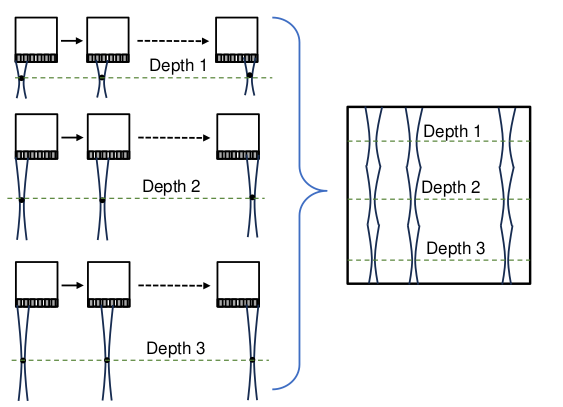

# Ultrasound

Created: November 28, 2025 6:55 PM
Contact: pranav.joshi@alumni.iitgn.ac.in
Creator: Pranav Joshi

### Lecture 1

- Medical imaging allows to look inside the body without cutting it open
- Artery has Greek root “arteria” which means “wind pipe”. This is because people used to think that arteries carry wind when they couldn’t see inside a living, breathing body and had to rely on autopsy.
- Medical Imaging techniques send and receive energy to measure physical properties of the target, such as attenuation, proton spin, scatter
- Medical imaging has many different “modalities”, such as
    - X-ray
    - Tomography
    - Magnetic Resonance Imaging (MRI)
    - Ultrasound
- Ultrasound is just sound with frequency beyond human hearing range (20kHz).
- Clinics use High-frequecy ultrasound which is in 2-15 MHz
- Merits of Ultrasound
    - safe (no ionising radiation and non-invasive)
    - inexpensive
    - portable (mobile scanners)
    - Gives high temporal resolution (> 50 frames/sec)
    - Gives sub-millimeter spatial resolution
    - Total time for imaging (acquisition time) is low
    - Provides real-time visualisation of moving structures
- Faults of Ultrasound
    - Low contrast images, making it hard to interpret anything
    - The probe/transducer has a limited “feild of view”, making the process operator dependent as the probe must be set in the correct location
    - If path of US has air, it doesn’t work. This cases problems when empty organs like bladder and lung and even bones come into play.
        
        This is also why a gel is applied on the probe, since water is still ok.
        

### Lecture 2 and 3

- History
    - 1826 : Jean Colladon determined speed of sound
    - 1877 : Rayleigh published “Theory of Sound”
    - 1880 : Curie brothers discovered Piezoelectric effect
    - 1910s : SONAR
    - 1940s : RADAR
    - 1940s : Karl Dussik imaged brain using Ultrasound
    - 1940s : George Ludwig characterised speed of sound in tissues
    - 1980s : Widespread use of ultrasound
- Production of Ultrasound
    - Piezoelectric effect is the tendency of some crystalline materials to generate a potential difference in response to strain and (physical) strain in response to Voltage
    - Reciprocity of piezoelectric materials : They can either generate of receive sound waves
    
     
    
- B-mode (Brightness mode)
    
    Here, the ultrasound transmitted is reflected back by the material based on its reflectivity.
    
    By measuring this back-scattered (reflected) sound, we can compute the reflectivity of the material (tissue).
    
- US frequency range for different purposes
    - Therapy : < 2 MHz, > 200kHz . Here we are trying to stimulate the tissue and not image it.
    - Clinical Imaging : 2 MHz to 15 MHz . Here we are trying to NOT stimulate the tissue
    - Small animal Imaging : 15 MHz to 50 MHz
    - Intravascular Imaging : 15 MHz to 50 MHz
    
- Types of waves involved in US
    - Longitudinal (similar to SONAR and RADAR)
    - Shear (transverse) waves are used in “Elastigraphy”
    
    Note that we are talking about waves with the tissue as the medium, not air.
    
- US pulses
    - US is send in pulses, with each pulse usually lasting for one period.
    - The period after which another pulse is sent (measured from start of sending first pulse) is called the Pulse Repetition Period (PRP)
    - The frequecy of sending pulses, namely $1/\text{PRP}$ is the Pulse Repetition Frequency (PRF)
    - The time for which the input signal is active in one PRP is called the “ON Time” or the “Pulse duration” and when it’s inactive, it’s “OFF Time”.
    Note that the Pulse Duration ($\text{PD}$) is not the same thing as the time period $T$ of one cycle. The “pulse” can actually be more than one cycle.
    - The fraction of time in one PRP for which input signal is ON is called the duty cycle.
    - The reason for the OFF period is so that the transducer (the peizoelectric) can receive sound rather than send it. Remember .. reciprocity.
        
        Basically, during the OFF time, the echos (reflections) of the pulses are recieved.
        
    - As you would expect, the OFF period is much more than the ON period, more than 99 times in fact.
    That is to say, in practice, duty cycle is less that 1%
    - The distance travelled by the pulse during the ON time, namely in one pulse duration is called the Spatial Pulse length, since this is also the spatial length of the pulse. 
    With basic physics, $\text{SPL} = \text{PD}\times c$ .
    Here $c$ is the speed of sound in the medium (tissue).
    Again, note that this is different from wavelength $\lambda = T \times c$.
- Speed of sound
    - Again, with basic physics, for *longitudinal* waves
        
        $$
        c = \sqrt{\frac{1}{\kappa \rho}} = \sqrt{\frac{B}{\rho}} where 
        $$
        
        Here
        
        - $B$ is bulk modulus or modulus of compression.
        - $\kappa = \frac{1}{B}$ is the compressibility
        - $\rho$ is the density
        
- Through-tissue Transmission set-up
    - Generate a pulse and have a transmitter (a transducer) transmit this (convert electrical signal to sound waves).
    - On another end of tank, have another transducer that converts the sound wave to electrical signal.
    - This electrical signal is then amplified, and then converted to a digital signal.
    - The initial case (A) is done with just water.
    - For the second case (B), do the same thing but now have a tissue block inside the tub.
    - Suppose the length of the tub is $L$, thickness of tissue is $h$ and speed of sound in water and in tissue is $c_w,c_1$ respectively, then the time in case A is $T_A = L/c_w$ and time in case B is $T_B = (L-h)/c_w + h/c_1$ . This gives us the increment as
        
        $$
        \Delta t = h (\frac{1}{c_1}-\frac{1}{c_w}) \\\implies \\
        \frac{1}{c_1} = \frac{1}{c_w} + \frac{\Delta t}{h} \\\implies \boxed{c_1 = \frac{c_w}{1+c_w (\Delta t/h)}}
        $$
        
    - Note that $\Delta t$ will usually be smaller than the SPL. But that’s not something to worry about since both cases have the same frequencies, same and SPL and our formula is mathematically correct and not just an approximation.
- Acoustic wave equation
    - Equation of state
        
        This describes how density changes with change in pressure. We simply have
        
        $$
        \frac{\partial P}{\partial t} = -\frac{B}{\rho}\frac{\partial \rho}{\partial t}
        $$
        
    - Equation of continuity
        
        This describes the changes in density relative to displacement
        
        $$
        \frac{\partial v_x}{\partial x} + \frac{\partial v_y}{\partial y} + \frac{\partial v_z}{\partial z} = -\frac{1}{\rho}\frac{\partial \rho}{\partial t} \\\iff \\
        \nabla \cdot \vec v = - \frac{1}{\rho}\frac{\partial \rho}{\partial t}
        $$
        
    - Equations of motion
        
        Describes change in velocity as a function of pressure.
        
        $$
        \frac{\partial P}{\partial x} = \rho  \frac{\partial v_x}{\partial t} \\\implies \nabla P = \rho \frac{\partial \vec v}{\partial t}
        $$
        
    - Final Derivation
        
        Taking second order partial derivatives of equations of motion and adding, we get
        
        $$
        \nabla^2 P = \rho \frac{\partial }{\partial t}\nabla\cdot  v 
        $$
        
        Then, combining equations of continuity and state, we get
        
        $$
        \frac{\partial P}{\partial t} = B (\nabla\cdot \vec v) \\\implies \frac{\partial^2 P}{\partial t^2} = B \frac{\partial}{\partial t}\nabla\cdot \vec v
        $$
        
        Finally, combining the two derived equations, we get :
        
        $$
        \nabla^2 P = \frac{\rho}{B} \frac{\partial^2 }{\partial t^2}P
        $$
        
        Or, 
        
        $$
        \nabla^2 P = \frac{1}{c^2} \frac{\partial^2 }{\partial t^2}P
        $$
        
        where $c = \sqrt{B/\rho}$
        
    - One dimensional case (Plane waves)
        
        Since $\frac{\partial P}{\partial y} = \frac{\partial P}{\partial z} = 0$ , we have
        
        $$
        \frac{\partial ^2}{\partial x^2}P = \frac{1}{c^2}\frac{\partial ^2}{\partial t^2}P
        $$
        
        This of course leads to the usual general form of
        
        $$
        P = f(x+ct) + g(x-ct)
        $$
        
        All you have to do is a change of variables. Describe $a,b$ as
        
        $$
        a = x+ct \\
        b = x-ct
        $$
        
        This will give
        
        $$
        P_x =P_aa_x + P_bb_x = P_a + P_b \\ P_t =P_aa_t + P_bb_t = cP_a - cP_b \\ P_{xx} = P_{aa} + 2P_{ab} + P_{bb} \\ P_{tt} = c^2P_{aa} - 2c^2P_{ab}+c^2P_{bb} \\\implies P_{xx} - \frac{1}{c^2}P_{tt} = 4P_{ab} = 0 \\\implies P_a = f'(a) \\\implies P = f(a) + g(b) \\\implies P = f(x+ct) + g(x-ct)
        $$
        
    - Spherical Waves
        
        Assuming that the wavefront is radially symmetric, we have
        
        $$
        \nabla^2 P = \frac{1}{r}\frac{\partial^2}{\partial r^2}(rP) = \frac{1}{c^2}\frac{\partial^2}{\partial t^2}P
        $$
        
        The solution to this is
        
        $$
        P = \frac{1}{r}f(r-ct) + \frac{1}{r}g(r-ct)
        $$
        
        Thus, amplitude decays as $1/r$
        
        Thus, the energy that reaches a unit area decays as $1/r^2$
        
- Attenuation
    
    It is any decrease in the signal amplitude. Some reasons are
    
    - Absorption
        
        This is when the material converts the wave to thermal energy
        
    - Diffraction
        
        This happens when the US pulse is not of a single frequency, causing some regions to not be stimulated.
        
    - Scattering
        
        This is decrease in amplitude due to the wave being reflected in random directions by particles of various sizes
        
    - Refraction
        
        This may happen when the wavefront is not normal to the material, which is actually pretty common. 
        
    - Mode conversion
        
        This is when a longitudinal wave is converted to a shear wave. This might happen in bones for example.
        
    
    The model of attenuation is defined empirically.
    
    The wave amplitude decreases exponentially in the medium as
    
    $$
    A_x = A_0 e^{-\mu_\alpha x}
    $$
    
    Here, 
    
    - $A_0$  is the amplitude at the source
    - $\mu_\alpha = \frac{1}{x}\ln(A_0/A_x)$ is called the “Amplitude Attenuation Factor” and is measured in Nepers per cm (Np/cm)
    - Attenuation Coefficient
        
        $$
        \alpha = (\frac{20}{\ln 10}) \mu_\alpha = \frac{1}{x} 10 \log_{10}((\frac{A_0}{A_x})^2) 
        $$
        
        This is measured in (dB/cm)
        
    
    The Attenuation coefficient further depends on the frequency as
    
    $$
    \alpha = a f^b
    $$
    
    where $a,b$ are constants and $b \approx 1$. In such as setting we have $\alpha \approx a f$ and people report the values of $a$ in $\frac{\text{dB}}{\text{cm}\text{ MHz}}$ as “Attenuation” rather than $\alpha$ (the attenuation coefficient). 
    
- Acoustic Impedance
    
    Suppose we have $P = P_0 + A\sin(\omega t+ c^{-1}\omega x)$ . Then, we will have
    
    $$
    \frac{\partial P}{\partial x} = Ac^{-1}\omega \cos(\omega t + c^{-1}\omega x) = \rho \frac{\partial }{\partial t}v \\\implies v = v_0 + \frac{Ac^{-1}}{\rho}\sin(\omega t + c^{-1}\omega x)
    $$
    
    Removing the DC components, we get
    
    $$
    p=P-P_0 = Z(v-v_0) = \rho \,c \, (v-v_0)
    $$
    
    where $Z = \rho \,c$ is the accoustic Impedance.
    
    This has units $\text{kg }\text{m}^{-2}s^{-1}$ also known as a Rayleigh, denoted as $\text{Rayl}$.
    
    In practice, the unit used is $\text{MRayl} = 10^6 \text{Rayl}$
    
- Reflection
    
    This is the decrease due to some energy being reflected backwards.
    
    Suppose we place the origin on the boundary between two mediums of speeds $c_1,c_2$. For plane wave, we have
    
    $$
    P_1 = A_1 \sin(\omega t-c_1^{-1}\omega x) \\ P_2 = A_2 \sin(\omega t-c_2^{-1}\omega x) \\ P_3 = A_3 \sin(\omega t+c_1^{-1}\omega x+\phi)
    $$
    
    where $v_1$ is original wave, $v_2$ is transmitted wave, and $v_3$ is reflected wave.
    
    Then, at the origin, we have
    
    $$
    P_1+P_3 =P_2 \\\implies \\ A_1\sin(\omega t) + A_3\sin(\omega t+\phi) = A_2\sin(\omega t)
    $$
    
    Also we can get the speeds as $P_1 = -Z_1 v_1, P_2 = Z_2 v_2, P_3 = -Z_1 v_3$ . The speeds also add due to super-position. Moreover, pressure and speed are related as $\partial P/\partial x =-\rho \partial v /\partial t$ so the sign for the $x$ term in the $\sin$ will be positive for original and transmitted wave and negative for reflected wave. Thus
    
    $$
    v_1 + v_3 = v_2\\\implies \\ Z_1^{-1}\omega A_1\sin(\omega t) - Z_1^{-1}\omega A_3\sin(\omega t +\phi) = Z_2^{-1}\omega A_2\sin(\omega t)
    $$
    
    This gives us
    
    $$
    \phi = 0 \\ 1 + A_r = A_t \\ 1 -  A_r = (Z_1/Z_2) A_t \\\implies A_t = 2Z_2 /(Z_1+Z_2) \\ A_r = \frac{Z_2-Z_1}{Z_1+Z_2}
    $$
    

### Lecture 4

- Reflection is a special case of scattering
- Scattering, in general is just redirection of the incident (original) wave
- The total pressure on the receiving transducer (homophone) is $p_\text{tot}(\vec x,t) = p_\text{inc}(\vec x,t) + p_\text{scat}(\vec x,t)$  .
The last component is due to scattering and is actually the sum of scattered waves from all the interfaces and objects.
- The individual scattered waves from the objects is combined via constructive or destructive interference when particles are very close (relative to $\lambda)$ and without interference (intensity added up) when the particles are far away.
This is actually a non-trivial result from scattering theory that will be too hard to derive.
The patterns that arise from the constructive and destructive interference of these scattered waves is called a Speckle pattern.
- Back-scatter coefficient
    
    Consider a particle that is scattering the wave. Let
    
    - $\Omega$ be the solid angle subtended by the receiver onto the particle
    - $P_{back}$ be the power for the scattered waves going back to the transducer.
    - Let $I_\text{inc}$ be the intensity for the original wave at the scattering volume’s location.
    
    If you do the same thing for $N$ particles in volume $V$ and add up the back-scattered waves to get the final power $N P_\text{back}$, then we can define the Back-scatter coefficient as
    
    $$
    \beta = \frac{NP_\text{back}}{VI_\text{inc}\Omega} = n\frac{P_\text{back}/\Omega}{I_\text{inc}} = n \frac{I_{\text{back},r}}{I_\text{inc}}r^2
    $$
    
    Here $n = N/V$ is the number density of the particles.
    
- Differential scattering cross section
    
    The solid angle $\Omega$ subtended by the receiver on the particle is usually very small.
    
    Let $\sigma(\Omega,\theta)$ be the area of the particle that sends scattered energy in the solid angle $\Omega$ at inclination $\theta$ to direction of incident ray.
    
    For example, for a perfectly isotropic spherical particle of radius $r$, we would have $\sigma = r^2\Omega$ .
    
    Then, we have $(\frac{d\sigma}{d\Omega})(\theta) = r^2$ as the differential scattering cross section (DSCS).
    
    In practice, the DSCS is not simply $r^2$ but rather varies with $\theta$. This is because the scatterer is not isotropic. In that case, we must write
    
    $$
    \sigma = \int_{\Omega} \frac{\partial \sigma}{\partial \Omega'} d\Omega'
    $$
    
    This is just the “cross section” for the solid angle $\Omega$ . If you multiply it by the incident intensity, you will get the power scattered to $\Omega$ as $I_\text{inc}\sigma$ . Then, clearly, the amount of power per-solid-angle (a rate) is just $I_\text{inc}(\frac{d\sigma}{d\Omega})$ .
    
    Consider the case where the transducer subtends a small angle $\Omega$ on the scatterer. Then the power transmitted back is 
    
    $$
    P_\text{back}=I_\text{inc}(\frac{d\sigma}{d\Omega})_{\theta=\pi} \Omega \\\implies\\ \frac{P_\text{back}}{\Omega I_\text{inc}} = (\frac{d\sigma}{d\Omega})_\pi \\\implies \\ \frac{I_{\text{back},r}}{I_\text{inc}} = (\frac{d\sigma}{d\Omega})_\pi \frac{1}{r^2}
    $$
    
    where $r$ is distance from the scaterer.
    
    In general, if you want the intensity of scattered waves going in direction $\theta$, you would use 
    
    $$
    \boxed{\frac{I_{\theta,r}}{I_\text{inc}} = (\frac{d\sigma}{d\Omega})_\theta \frac{1}{r^2}}
    $$
    
    Now, since $I_\text{inc} = I_0 \frac{r_0^2}{x^2}$  where $r_0$ is radius of transducer, $x$ is the distance from transducer, $I_0$ is the intensity at the source and suppose $I_1 = \frac{P_\text{back}}{\Omega x^2}$ is the intensity of the scattered waves at the transducer, we have
    
    $$
    \frac{I_1}{I_0} = \frac{I_\text{inc}(\frac{d\sigma}{d\Omega})_\pi\frac{1}{x^2}}{I_\text{inc}\frac{x^2}{r_0^2}} =\frac{r_0^2}{x^4}(\frac{d\sigma}{d\Omega})_\pi
    $$
    
    If there are many particles for the scattering volume $V$, with number density $n$, we get 
    
    $$
    \frac{I_1}{I_0} = \frac{r_0^2}{x^4}(\frac{d\sigma}{d\Omega})_\pi nV
    $$
    
    Note that $\frac{I_1}{I_0}\frac{1}{V}x^2$ is NOT the back scatter coefficient. The BSC is instead
    
    $$
    \beta = \frac{P_\text{back}}{I_\text{inc}\Omega}n = n(\frac{d\sigma}{d\Omega})_\pi
    $$
    
    This is a property of the material and has nothing to do with the transducer placement and size, whereas $I_1/I_0$ does depend of them as
    
    $$
    \frac{I_1}{I_0} = \frac{r_0^2}{x^4}\beta nV
    $$
    
- Types of particles and how they scatter waves
    
    Let $r$ be the diameter of the object/particles. 
    
    - Specular (mirror like) Scattering
        
        This happens when $r \gg \lambda \iff kr \gg 1$, that is to say that the object is large.
        
        In such a scenario, normal reflection happens at the planar interfaces of the object with the medium.
        
        The reason we call this “scatter” is because the reflected waves go in all directions. The energy that is reflected back is called as “back-scatter”
        
        The reflection happens with the basic principle of $\theta_\text{inc} = \theta_\text{ref}$ and is thus incident orientation dependent.
        
        This is what actually leads to US imaging working.
        
    - Rayleigh Scatter.
        
        Here the particle is very small, namely $kr \ll 1$ . 
        
        In this case, the scattered wave is almost spherical. This is a completely different phenomenon from reflection of plane waves.
        
        These scattered waves can further interfere with each other constructively or destructively depending on the number density $n$ which tells how close the particles are.
        
        These objects contribute to the background texture of the image.
        
        Remember from before that
        
        $$
        \boxed{\frac{I_{\theta,r}}{I_\text{inc}} = (\frac{d\sigma}{d\Omega})_\theta \frac{1}{r^2}}
        $$
        
        For Rayleigh scattering we have 
        
        $$
        (\frac{\partial \sigma}{\partial \Omega})_\theta = \frac{k^4a^6}{9}(1-\frac{3}{2}\cos \theta) \\\implies \\ \frac{I_{\text{scat}}(\theta,r)}{I_\text{inc}} = \frac{k^4a^6}{9r^2}(1-\frac{3}{2}\cos \theta)
        $$
        
        Here 
        
        - $a$ is the radius of the particle
        - $r$ is the distance from the scatterer
        - $\theta$ is the angle of scatter (measured with incident plane wave’s direction as reference)
        - $\sigma(\theta,\Omega)$ is the effective area for power scattered to a solid angle $\Omega$ inclined to the incident by angle $\theta$.
        
        Notice that we have the $k^4$ term in numerator and thus a $1/\lambda^4$ factor. 
        This means that higher frequencies are scattered more (similar to how EM waves with high frequency, such as blue light is scattered more, and thus back-scattered more, by small particles in atmosphere).
        
    - Diffractive (Mie) scattering
        
        This is when $kr \sim 1$ .
        
        Here there is some directional dependence and less dependence on frequency as compared to Rayleigh scattering. 
        
- Fully Developed speckle
    
    When $a/\lambda$ exceeds a critical value, the Rayleugh scattered waves interfere and the amplitude $A$ follows a Rayleigh probability density function (PDF). For this PDF, we have the Signal-to-Noise-Ratio
    
    $$
    \text{SNR} = \frac{E[A]}{\text{Std}(A)} \approx 1.91
    $$
    
    Note that $E[A]$ is what we should have gotten if there was no interference.
    
- Speckle
    - These are mostly characterised as noise, but are deterministic and not time varying / random, unlike electronic noise
    - Speckles reduce image quality usually
    - Except in case of motion tracking, where speckles can actually be useful

### Lecture 5

- Focused Transducer
    
    Focused transducers are fitted with a concave (yes, concave) converging lens (similar to those made of glasses, but now with a higher speed of wave than the medium rather than lower).
    
- Transducer $P_{pp}$ vs $V_\text{in}$
    
    The peak-to-peak pressure of the waves generated in response to the input voltage to the transducer changes linearly when voltage is moderate and starts to saturate when voltage is high
    
- Hydrophone
    
    A hydrophone is a very sensitive kind of transducer that converts pressure to voltage. It should ideally 
    
    - be of minimal size (just a point) so that the signals aren’t averaged over space and only the signal at a particular location is measured. Plus, a big hydrophone can disturb the pressure field itself.
    - be isotropic (equal sensitivity in all directions).
    - have infinite bandwidth so that all kinds of frequencies can be detected.
- Measured $V_{pp}$ vs distance $x$
    
    Let $x$ be the distance between a focused transducer with focal length $x_f$ and a hydrophone and $V$ be the voltage (peak-to-peak) measured by the hydrophone in response to US generated by the transducer. Then, the $V$ vs $x$ graph, namely the “Axial Pressure Profile” ($V$ is a proxy for $p$) has a peak when $x= x_f$.
    
- Recommended maximum hydrophone radius
    
    $$
    r_\text{H} \le \frac{\lambda}{8}\sqrt{\frac{x^2}{r_\text{T}^2} + 1}
    $$
    
    where
    
    - $x$ is distance between transducer and hydrophone
    - $r_T$ is radius of transducer
- Intensity
    
    At a point, with pressure $p = P- P_0 = A_P\sin(\omega t-kx+\phi)$ and velocity $v = p/Z$, 
    
    - The instantaneous intensity is $I = pv = p^2/Z$
    - The peak intensity is $I_p = A_P^2/Z$
    - The average intensity over one cycle is, assuming amplitude $A_P$ for $p$ is
        
        $$
        I_\text{avg,T} =\frac{A_P^2}{2Z}
        $$
        
- Intensity profile
    
    Suppose $y,z$ are the distances from the axis (normal line) of a US beam, and $I(x_f,y,z)$ is the intensity at different points on the cross section of the beam at focus ($x = x_f$). Then, the graph of $I_{avg,T}(x_f,y,0)$ vs $y$ is the intensity profile. 
    
    We define
    
    - The spatial peak intensity as
        
        $$
        I_\text{SP} = I_\text{avg,T}(x_f,0,0) 
        $$
        
    - The spatial (area) average intensity as
        
        $$
        I_\text{SA,A} = \frac{1}{S}\int_{S} I_{\text{avg},T}(x_f,y,z) dydz
        $$
        
        where $S$ is the aperture area.
        
    - The beam uniformity factor as
        
        $$
        \text{BUF} = \frac{I_\text{SP}}{I_\text{SA}} \ge 1
        $$
        
        When BUF is 1, the beam is uniform over the whole aperture.
        
- Intensity with time varying amplitude
    - The pulse average intensity is
        
        $$
        I_\text{PA} = \frac{1}{\text{PD}}\int_0^\text{PD}\frac{p^2}{Z}dt
        $$
        
        where PD is the pulse duration
        
    - The temporal average intensity is
        
        $$
        I_\text{TA} = \frac{1}{\text{PRP}}\int_0^\text{PRP}\frac{p^2}{Z}dt \\ = \\
        \frac{1}{\text{PRP}}[\int_0^\text{PD}\frac{p^2}{Z}dt + \int_\text{PD}^\text{PRP}0dt]\\ = \\ \frac{\text{PD}}{\text{PRP}}I_\text{PA} =\text{DF}\times I_\text{PA}
        $$
        
        where PRP is pulse repeat period and DF is the duty factor.
        
- All intensity metrics (highest value to lowest)
    - Spatial Peak, Temporal Peak : $I_\text{SPTP} = I_p(x_f,0,0)$
    - Spatial Average, Temporal Peak Intensity $I_\text{SATP}$
    - Spatial Peak Pulse Average (SPPA) 
    Note that SPPA < SATP is only a heuristic, while other inequalities are mathematically true.
    - Spatial Avg. Pulse Avg. (SAPA)
    - Spatial Peak Temporal Avg. (SPTA)
    - Sp. Peak, Temp. Avg. (SPTA)
    - Sp. Avg., Temp. Avg. (SATA)
    
    The SPTA and SATA intensities have the lowest values and are often reported.
    
- Reflection and intensity
    
    We already know that
    
    $$
    p_i + p_r= p_t \\\text{ and }\\ \vec v_i+\vec v_r = \vec v_t \iff \frac{p_i}{Z_1} - \frac{p_r}{Z_1} = \frac{p_t}{Z_2} \\\implies \\ 
    \boxed{R = \frac{p_r}{p_i} = \frac{Z_2-Z_1}{Z_2 + Z_1}} \\
    \boxed{T = \frac{p_t}{p_i} = \frac{2Z_2}{Z_1+Z_2}}
    $$
    
    Now, since $I = pv = p^2/Z$ , we can write
    
    $$
    \boxed{R_I = \frac{I_r}{I_i} = \frac{p_r^2/Z_1}{p_i^2/Z_1} = (\frac{Z_2-Z_1}{Z_2+Z_1})^2 }\\ 
    \boxed{R_T =\frac{I_t}{I_i}= \frac{p_t^2/Z_2}{p_i^2/Z_1} = \frac{4Z_2Z_1}{(Z_2+Z_1)^2}}
    $$
    
- Reflection at an angle
    
    Suppose the incident wavefront makes $\theta_i$ with the normal, reflected wavefront makes $\theta_r$ with the normal and transmitted wave makes $\theta_t$ , then
    
    $$
    \theta_r = \theta_i  \quad [ \text{Reflection Laws}]\\
    \frac{\sin\theta_t}{c_2} = \frac{\sin \theta_i}{c_1} \quad [\text{Snell's Law}] \\
    
    $$
    
    Now, for coefficients, we use
    
    $$
    P_i + P_r = P_t \text{ and} \\
    (\vec v_i +\vec v_r)\cdot \hat n = \vec v_t\cdot \hat n \implies  \\ \frac{P_i}{Z_1}\cos\theta_i - \frac{P_r}{Z_1}\cos \theta_r = \frac{P_t} {Z_2}\cos \theta_t \quad [x \text{ component}] \\\iff \frac{P_i}{Z_1\sec \theta_i} - \frac{P_r}{Z_1\sec \theta_r} = \frac{P_t}{Z_2\sec \theta_t}
    $$
    
    It’s easy to see that $Z_1\sec\theta_i$ and $Z_2\sec\theta_t$ are the effective impedences. This gives
    
    $$
    R = \frac{Z_2\sec\theta_t - Z_1\sec \theta_i}{Z_2\sec\theta_t + Z_1\sec \theta_i} \\\,\\
    T = \frac{2Z_2\sec\theta_t}{Z_2\sec\theta_t + Z_1\sec \theta_i}
    $$
    
    For intensities
    
    $$
    R_I= R^2 \\\,\\ 
    T_I = 1-R_I^2 = \frac{4\cdot Z_1\sec\theta_i\cdot Z_2\sec\theta_t}{(Z_2\sec\theta_t + Z_1\sec\theta_i)^2}
    $$
    
    Now, what about the tangential components of velocities ?
    
    They need not match. The normal components need to match because the mediums share a boundary and if a particle from medium 1 on the boundary wants to more right, the boundary must move to right by that amount, meaning that a particle from medium 2 must move to the right by that amount. 
    

### Lecture 6

- ***A***mplitude mode (1D)
    - Send a short US pulse
    - Assume constant speed of sound $c$, but varying impedances for different objects in the path.
    - RF signal reception
        
        Record the pressure amplitude of reflected wave (converted to voltage by the transducer) for the OFF duration.
        
        Peaks in the graph of pressure amplitude correspond to interfaces of objects.
        
        Since the *voltage* signal has frequencies in MHz, which is the Radio Frequency in light, this signal is called “Radio Frequency (RF) Signal”.
        
    - Band-pass filter
        
        The first step after acquiring the signal is to remove noise. 
        We already know the frequency we are interested in, namely the frequency of the US that was sent. 
        The received frequencies might have variations due to Doppler effect.
        We pass the raw signal through a band-pass filter centred around the transducer’s resonance frequency $f_0$ (the one that was sent out in ON phase)
        
    - ADC
        
        At this point, for further processing, we digitise the signal. 
        
    - TGC
        
        Later peaks will be less prominent in raw data because by that point the wave has 
        
        - been transmitted through interfaces potentially many times
        - been attenuated by passing through mediums.
        
        To fix the effects of attenuation, we do something called the Time-Gain Compensation (TGC) which gives the correct signal.
        
        $$
        \text{RF}_\text{TGC}(t) = G(t)\,\text{RF}_\text{BP}(t) \\\text{where } G(t) \propto e^{\mu \cdot ct}
        $$
        
        Here $\mu$ is amplitude attenuation coefficient and $c$ is the speed of sound.
        
        Note that $ct/2$ is the distance for which the incident wave was getting attenuated and $ct/2$ for which reflected wave was getting attenuated, given $ct$ as the effective distance.
        
        Also note that I have written the equations as if it’s analog, because the TGC stage can be analog or it can be digital. It’s upto the implementation. 
        
    - Envelope detection (demodulation)
        
        Here, we apply something known as “Hilbert Transform” that extracts the envelope and gives us only the instantaneous (kind of) amplitudes.
        
    - Scan conversion (optional)
        
        For an object $d$ away, the reflected wavefront will arrive at $t = 2d/c$ . So, convert the pressure data with sampling intervals $\Delta t$ to pressure data with spatial sampling intervals $\Delta d = (c/2) \Delta t$ .
        
        The final signal is called an A-line.
        It’s only for one PRP (actually, just the listening time, but with 1% duty factor, who cares..).
        
    - Uses of A mode
        
        A-mode is primarily used in civil and mechanical engineering tasks like non-destructive testing of structures (railway tracks, aircraft wings, etc.)
        Also used for ophthalmic US, where we get the dimensions of eye. 
        
    
- ***B***rightness mode (2D)
    
    This is just multiple A-lines. 
    Suppose the US is sent into the x direction, the A line formed will give us the info about the regions with that particular y,z coordinates where the transducer currently is.
    
    Now, we can have a linear array of transducers in the probe or have a moving (say, in y direction) transducer in the probe that will acquire multiple such A-lines. 
    
    All these (raw) A-lines will then go through some processing and we will get a B-mode *image* (not just a signal, like in A mode).
    
    This image will be the xy cross section of the object/organ/testicle??/etc.
    
    Since we are getting images every scan/sample, we will essentially get a video, allowing us to see what’s happening LIVE.
    
    - Stuff that is imaged in B-mode
        - Fetus (Fetal US)
        - Heart (Echo-cardio-graphy)
    - Echogenicity
        
        This is how bright an object appears in a B-mode image.
        
        - Hypo-echoic : Low echogenicity, meaning dark appearance
        - Iso-echoic : Same brightness as surrounding structures
        - Hyper-echoic : Brighter than surrounding structures
    - Phantom
        
        A phantom is a test material block used for testing and calibrating US equipment and for teaching and research purposes. 
        
- 3D B-mode
    
    This is when you either have a matrix of transducers in your probe or a scanning linear array transducer.
    
    Now, you will be getting a 3D tensor of pixel values every scan.
    
    If you do this 3D imaging with real-time-processing then we get “4D imaging” which is just real-time-3D. This is a thing because transducer matrices are very un-manageable; they have a lot of channels, each requiring its own ADC, buffer, piezoelectric, etc.; they heat quickly because of how densely the hardware needs to be packed, and the actual cable for such a probe is as good as a massive block of copper, which makes it too stiff to use as a probe; and finally the problem of interference of the US waves sent); and more than all this, the cost…
    
- ***M***otion mode
    
    Now, rather than stacking A-lines with varying values of y or z, we stack A-lines with varying values of t. 
    
    The transducers used for M-mode have high frame rates. All that happens is the the A-line is put vertically along the y-axis of the graph with time on the scale of PRPs on the x-axis, giving an image that describes how the objects on a particular x-line move with time.
    
    - Anatomic M-mode (AM mode)
        
        Sometimes, B-mode images are used to get the A-lines that are stacked in the M-mode image. These A-mode lines are also called M-mode lines.
        
        Note that this is NOT how M-mode actually operates. For real M mode, the (single) transducer should remain in the same location and have high frame rate.
        
    
- Doppler effect
    - No angle
        
        Suppose the object is moving away from the transducer at speed $v$ , and the US frequency is $f_0$ , and the the prominent frequency in the recieved signal is $f_1$ , and suppose at $t = 0$ , the object reflected a compression. Then, the next time it will receive and reflect a compression is
        
        $$
        t = \frac{\lambda_0}{c-v} = \frac{c/f_0}{c-v}
        $$
        
        Now, in that time, the first compression has travelled backwards so that the distance between the compression and the object is
        
        $$
        (c+v)t = \frac{c}{f_0}(\frac{c+v}{c-v})
        $$
        
        This is the wavelength $\lambda_1$ . Thus, the frequency is
        
        $$
        f_1 = f_0 (\frac{c-v}{c+v}) = f_0 -f_0 (\frac{2v}{c+v}) \\\implies\\ f_0-f_1 = f_D = f_0 \times \frac{2v}{c+v}\\\implies\\ \boxed{f_D \approx f\times \frac{2v}{c}}
        $$
        
    - $\vec v$ makes angle $\theta$ with the transducer
        
        Now, the effective speed is $\vec v\cdot \hat c = v\cos \theta$ . Thus, we have
        
        $$
        f_D = f_0 - f_1 = f_0 \times \frac{2v\cos \theta}{c+v} \approx f_0 \frac{2v\cos\theta}{c} 
        $$
        
    - Using Doppler effect
        
        We can place the probe at a specific Doppler angle $\theta$ relative to a stream of particles, say blood and then compute the speed of the particles as
        
        $$
        v \approx \frac{c\cdot f_D }{2f_0\cos \theta}
        $$
        
- Continuous-wave Doppler Mode
    
    Here you have two piezoelectric crystals, one that continuously transmits and other that continuously receives.
    
    The received signal will have first the original signal sent at $f_0$ and the reflected signal at $f_1$, and noise. From this signal, we can compute $f_D = f_0 - f_1$ and thus $v$ very accurately.
    This is because the qudrature demodulator (a partly analog component) can directly extract $f_D$. 
    
    But, as you would’ve guessed, we get no information about time delay and thus can’t compute $d$.
    
- Pulsed-wave Doppler mode
    
    Here US pulses are sent (like usual) and from the received echoes, the phase $\phi$ is extracted for each depth. To do this, many pulses are sent actually and from some 8 to 64 echoes (before Hilbert transform), we do IQ demodulation for each depth, giving us the rate of change of phase, namely the (angular) frequency, which is $f_1$.
    
    Note that this works only for objects with $v\ll c$ , say blood (0.5 m/s) for example. 
    
    Here, due to the Nyquist criterion, we cannot have
    
    $$
    |f_D| > \frac{\text{PRF}}{2}
    $$
    
    Note that nothing is said about $f_0$ , because 
    
    1. if $f_D$ is small, both $f_0$ and $f_1$ are aliased in the same way (same number or rounds in the DFT), save for an edge case when we get $f_s-f_D$ as the difference instead.
    Was just thinking .. can’t we restrict $|f_D| < f_s/2$ and then take the mod of whatever difference we’ll get and then the absolute ? Removes the whole I/Q demodulation procedure right ? Idk…
    2. Before any FFT, we perform I/Q demodulation, which shifts the frequency spectrum by $f_0$ . This can be analog or digital (modern).
    
    Thus, we have
    
    $$
    |v| \le \frac{c}{f_0 \cos \theta} \frac{\text{PRF}}{4}
    $$
    
    This means that very fast moving objects cannot be imaged for their speeds using PW Doppler.
    
    Unlike CWD which only gives a single value, namely $f_D$ for the most prominent reflection/echo, for PWD, we get a whole line. So, there’s a tradeoff.
    
- Color Doppler
    
    Similar to B-mode where we stack A-lines, we can stack multiple Doppler lines to get an *image*. In this case, we don’t know $\theta$ before-hand and we instead compute
    
    $$
    v_\perp = v\cos \theta = \frac{c}{2f_0}f_D
    $$
    
    Now, this quantity can be positive (away from transducer) or negative (towards), which we color as blue and red.
    
    Mnemonic : BART (Blue Away, Red Towards)
    
- Power Doppler
    
    In PWD, the IQ modulator does a FFT at some point, giving us the frequency spectrum of the received echo. From that, we compute the mean frequency, weighted by the amplitude.
    
    Power Doppler doesn’t do that and instead, just uses the total power received for that depth after removing frequencies very close to the original frequency by applying a low pass filter after I/Q.
    
    This gives us a “power line”, which is never really used directly. Instead, we always stack such lines to get an image.
    

### Lecture 7

- Artifacts
    - Artifacts are unwanted features in the images
    - Artifacts are deterministic while noise is usually random. Still, artifacts are a kind of noise.
- Wrong Assumptions in image reconstruction
    - $c$ is constant throughout (homogenous media) → Leads to wrong values of $x = (c/2)t$
    - $a$ is constant throughout (homogenous media) → Used in TGC and can lead to accoustic enhancement or shadowing
    - US propagates in a straight path (no weird reflections or refractions) → Edge refraction artifacts
    - Only wavefronts arising from a single reflection (first order reflection) are present → Leads to mirroring and reverberation
    - US beam is planar and has a finite thickness → Side lobes
    - All reflections from ROI will come back in one PRP →Range Ambiguity
- Reverberation
    
    This happens when the path has 2 or more interfaces with high $R$. In such cases, the first reflections from the reflector will be captured correctly with a bright line/spot but 2nd, 3rd, … n-th order reflections will also be captured which will be interpreted as objects (with low $R$) farther away from the reflectors. This usually causes a comet tail, with bright lines spaced at the same distance as the reflectors.
    
    This can also happen between a single strong reflector and the transducer surface.
    
- Acoustic shadowing
    
    We do TGC with an assumption of constant $a = \alpha/f_0$, which might not be true. 
    
    Suppose the $a$ we have set is correct for the most part, but there is some object with high attenuation, then our TGC won’t be able to account for the decrease in intensity for the objects behind the high attenuation object. 
    
    These farther objects will then appear darker in the image than what they ideally should be.
    
    This isn’t *always* bad though. For example, calcification in the liver can be identified using this, and so can be air filled areas in lungs
    
- Acoustic enhancement
    
    This is the opposite of acoustic shadowing. 
    
    In this case the farther (distal) objects appear brighter than they should.
    
    Note : 
    
    - proximal = closer to transducer
    - distal = away from transducer
- Non-uniform brightness due to diffraction
    
    Didn’t get much from the lecture .. 
    
- Range (Ambiguity) artifacts
    
    Usually, the PRP is set so that the reflections from the deepest parts of the region of interest can come back before PRP gets over.
    
    If there is a strong reflector just beyond that region, its reflected wavefront will reach the transducer in the next period at a time that doesn’t correspond to its actual depth. 
    
    Thus, the image will now have an object that shouldn’t really be there.
    
- Side Lobe artifacts
    
    If the beam that is sent out is perfectly planar and of narrow thickness, it will only produce reflections from the objects in front of the transducer.
    
    But in practice, beams spread out eventually, and thus reflections from objects that are not directly in front of transducer are also captured.
    
    These reflections then interfere and give an incorrect A-line.
    
    For example, when there is nothing in the region directly in front of the transducer, but something with high echogenicity a bit to the side, that thing will also be captured, but then interpreted as something directly in front of the transducer by our pipeline.
    
    Thus, we will get bright regions in the left and right side of the high echogenecity object in the B-mode image. These bright regions are called side lobes.
    
- Edge refraction artifact
    
    We assumed that the beam will go straight through the path, but that doesn’t always happen.
    
    If the beam gets refracted at an edge (interface) where it makes a high angle of incidence, then it will go in a different direction, and not through the region we wanted it to go through. Thus, stuff behind he edge will appear dark. 
    
    Similarly, the edge itself will appear dark because the reflected wave will not be going backward.
    
- Mirror artifact
    
    This is similar to reverberation, except here you have one very strong reflector about which *all* objects are mirrored because of 2nd order reflections . Suppose you have an object A and mirror B which is $d$ away from A, the sequence for a 2nd order reflection is :
    
    - US reaches A and is reflected back → first order reflection
    - US reaches B
    - B reflects US towards A
    - US reaches A (extra $d/c$)
    - A reflects US back to B
    - US from A reaches B (extra $d/c$)
    - B reflects US (from A) to the transducer
    
    In total, extra $2d/c$ time is taken, which gives an extra $(2d/c)\times (c/2) = d$ depth to the object A more than B, effectively mirroring it about B.
    
- Transducer Ringing artifact
    
    Transducer ringing is the slow decay of the (mechanical) vibration after the pulse (ON period) ends.
    
    This causes extra frequencies in the FT of the outgoing pulse. How bad this effect is, is quantified by the “Quality Factor”, given as
    
    $$
    Q = \frac{f_0}{\Delta f}
    $$
    
    Here, $f_0$ is the frequency we want to produce and $\Delta f$ is the range around $f_0$ where the amplitude of the frequency (in FT) is above 70.7% of the amplitude for $f_0$ or 50% of power for $f_0$ .
    
    After the input voltage is OFF, the transducer rings (vibrates without input) down (decays) as
    
    $$
    x(t) =A_0 e^{-t/\tau}\cos(2\pi f_0 t) \\\text{where } \tau = \frac{Q}{\pi f_0}
    $$
    
    The ringing artifact is simply when the echo comes during the time when the transducer is ringing, which causes it to be measured when the ON stage isn’t “completely” over (officially, it is, since it’s just the duration of the electrical pulse).
    
- Doppler artifact
    
    In color Doppler of things like the heart, we usually only want to measure velocity of the blood, but we’ll also have the muscles moving. 
    
    This then further causes red and blue spots in the image that we don’t want to see. 
    

### Lecture 8 and 9

- Resonance modes of transducer
    - Thickness mode :
        
        Here the transducer crystal vibrates in the x direction (facing the target). 
        
        The resonant frequency (first harmonic) is $f_0 = c/(2l)$ where $c$ is speed of sound in the crystal and $l$ is the thickness of the crystal. In general for harmonics,
        
        $$
        l = n\frac{\lambda}{2} = \frac{nc}{2f} \\\implies \boxed{f = \frac{nc}{2l}}
        $$
        
    - Radial mode :
        
        Here, the transducer crystal vibrates radially in the y-z plane
        
- Materials for piezoelectric crystal
    - Quartz
    - Lead (Pb) Zirconium Titanate (PZT)
    - PVDF (no idea what this is..)
- Backing layer
    
    In CW applications, we don’t really switch to the OFF phase and so there is no ring down. But for PW, we need something that will reduce the ringing. 
    
    This can be done by placing a backing layer behind the transducer crystal. This is usually made of epoxy or rubber.
    
- Lens
    
    We place plano-concave lenses made of solid material in front of the crystal (plane side facing crystal) for focusing the sound generated.
    
    The plane surface of the lens won’t do any refraction. 
    
    The concave surface is in contact with the medium, which is either soft tissue or some gel, or liquid. This medium will have lower speed of sound than the lens. Thus, the relative refractive index of the medium is higher, meaning that waves bend towards the normal (which points to the centre of curvature) as the pass through the lens-medium interface, hence converging.
    
    The width of the beam at the focus, also known as the focal width $w_F$ is inversely proportional to $D$, the aperture (diameter of crystal for simple cases) of the transducer. The width is defined as the (length of) range of $y$ at $x_f$ where the intensity is at most 3 dB lower (that means $10^{0.3} \approx 2$ times lower intensity) than that on the focus, namely $(x_f,0,0)$. The proper formula is
    
    $$
    w_f \approx 1.02 \lambda F = 1.02 \lambda \frac{x_f}{D} \approx \frac{\lambda x_f}{D}
    $$
    
    There’s another metric called the f-number (no, this is not something like the F-score, and neither is it the focal length). It’s defined as
    
    $$
    F := \frac{x_f}{D}
    $$
    
- Unfocused transducer
    
    Just like for focused transducer you have
    
    $$
    w(x) \approx 1.02 \frac{\lambda x}{D} \approx \frac{\lambda x}{D}
    $$
    
    This is valid when $x \gg x_N = \frac{D^2}{4\lambda}$ , for different reasons than the case with focused transducers.
    
    Here, $x_N$ is the near field length of the transducer, sometimes called the “natural focus”.
    
    Unlike a focused transducer, there is no focal beam width here, although one can say, using the Fraunhofer formula that $w(x_N) \approx 0.26 D$ .
    
- Matching layer
    
    Suppose the acoustic impedance of the lens (or the medium if unfocused) is $Z_2$ and that of the crystal is $Z_1$ , then the transmission coefficient for intensity is
    
    $$
    T_I = \frac{4Z_1Z_2}{(Z_1+Z_2)^2} = \frac{4}{2+\frac{Z_1}{Z_2} + \frac{Z_2}{Z_1}}
    $$
    
    Suppose I keep another layer (called matching layer) between them of impedance $Z$, then the effective transmission coefficient would be
    
    $$
    T_{I,1}T_{I,2} = \\ \frac{16}{[(\sqrt{\frac{Z_1}{Z}} + \sqrt{\frac{Z}{Z_1}})(\sqrt{\frac{Z_2}{Z}} + \sqrt{\frac{Z}{Z_2}})]^2} =\\ 16 [\frac{\sqrt{Z_1Z_2}}{Z} + \frac{Z}{\sqrt{Z_1Z_2}} + \sqrt\frac{Z_2}{Z_1} + \sqrt\frac{Z_1}{Z_2}]^{-2}
    $$
    
    Using the AM-GM inequality, this is clearly maximised when $Z = \sqrt{Z_1Z_2}$ .
    
    In that case, it gives
    
    $$
    \frac{16}{(2+\sqrt\frac{Z_1}{Z_2} + \sqrt\frac{Z_2}{Z_1})^2} = \frac{16}{(\sqrt[4]{\frac{Z_1}{Z_2}} + \sqrt[4]{\frac{Z_2}{Z_1}})^4}
    $$
    
    Using the power mean inequality, on can easily show that this is bigger than the original $T$ without the matching layer.
    
    This derivation doesn’t focus on the fact that the reflected waves are reflected again to the positive x direction and this process just keeps on going. 
    
    The actual math for this is much more complicated, and also involves the width of the matching layer. 
    
    It turns out the most energy is put into the lens/medium when we have 
    
    $$
    l_M = \frac{\lambda}{4} + n\frac{\lambda}{2} ;\quad n\in \mathbb{W}
    $$
    
    Here $l_M$ is the thickness of the matching layer.
    
- Transducer arrays
    - Multiple crystals. Can “scan” (acquire A-lines) electronically and construct B-mode images.
    - Kerf is the space between *nearest* edges of two adjacent crystals
    - Pitch is the space between the centres or the *corresponding* edges of the crystals.
    - Pitch = Kerf + element width
    - For linear arrays, Pitch $< \lambda$ avoids grating lobes
    - For phased arrays, Pitch $< \lambda/2$ avoids grating lobes
    - Usually the number of elements is a power of 2, such as 32, 64, 128, etc.
    - For single element transducers, we have focused beams. For multi-element transducers, each element generates spherical waves, which interfere to give (approximate) plane waves, which is, in practice just a beam with large $w_f$ and even larger $x_f$ .
    - Plane wave imaging is faster, but lateral resolution is poor due to large width of the beam (grating lobes).
    - Each element will receive reflected wavefront from objects at slightly different times.

### Lecture 10

- Frame rate
    
    The actual sampling frequency (for A-lines) is usually much higher than the frame rate.
    
    We define frame rate as the frequency of obtaining images. 
    
    For a moving single element transducer for example, each A-line needs one PRP. Thus, each frame needs $N_A\times\text{PRP}$ where $N_A$ is the number of A-lines for each image. This gives us a frame rate of $1/(\text{PRP}\times N_A)$. 
    
- Linear array imaging
    
    Here, from the $N$ elements that we have, only $M$ adjacent elements are fired for one PRP. This gives us one A line. 
    
    For one image, we do this $N- M+1$ times (all possible groups). 
    
    The time for one frame is thus $(N-M+1)\times\text{PRP}$ and the frame rate is 
    
    $$
    \frac{1}{(N-M+1)\times\text{PRP}}
    $$
    
- Curvilinear (sector) array
    
    In linear array imaging, we were sending beams (from each group) only in the positive x direction. 
    
    In curvilinear arrays, the elements are arranged on a curve rather than a line, giving a wider range.
    
    The A lines thus constructed need to scan converted from $r,\theta$ coordinates to $x,y$ .
    
    This is also a kind of scan conversion.
    
- Phased arrays
    
    In Both linear and curvilinear arrays, the direction of the wavefront is fixed after manufacturing and can’t be programmatically changed.
    
    In phased arrays, it can be. We slightly delay the input voltage pulse to the transducers in an ordered fashion to change the direction of the plane wave.
    
    In CW application, this time delay may not be an actual delay but a change in the phase of the pulse… hence the name “phased array”.
    
    Also, in phased arrays, *all* the elements are fired together, very different from what happens in linear arrays (elements fired $M$ at a time). I don’t really understand the reason behind this.. but ok.
    
- 2D arrays
    
    This is similar to linear arrays. You fire a group of elements at a time. 
    
    A “fully sampled” 2D array (with stride of 1) is rare. 
    
- 1.5 D arrays
    
    Unlike 2D array, where each row (each element in a row has same elevation $z$) has its own power sources (one for each element in the row) and each of these sets of power sources can be controlled differently, in 1.5D array, rows are grouped, and each group of rows share the same power source.
    
    Essentially, a group is just 1D arrays stacked vertically a bunch of times. 
    
    Thus, elements with the same $x,y$ but different $z$ (elevation.. my coordinate system is different from conventional) in a group of rows are fired using the exact same pulse. So, there can’t be any steering like in phased arrays (both 1D and 2D).
    
    Why group ?
    
    In linear arrays, each group acts like a focused single element transducer. But that focusing only happens in the y (lateral) direction. With a bunch of rows stacked in a group, it also happens in the z (elevational) direction.
    

### Lecture 11

- The impulse response of the transducer is measured using a hydrophone.
- Beam pattern for single element transducer
    
    The shape of the beam can we described as :
    
    - Fresnel zone :
        
        Here the beam-width (the max lateral range before 6dB loss in intensity) oscilates a bit with average value of $D$ and achieves minimum of $D/2$ at the focus $x_N$. This zone lasts till $x < x_N$ for unfocused transducers, which is often conservatively written as $x < D$ . 
        
        Here, the intensity $I_\text{SPTA}$ also varies a lot with $x$, similar to standing waves
        
        For focused transducers, there is no fresnel zone and instead we have a “focal zone” which starts from $x_f - \lambda F^2 = x_f - \lambda (x_f/D)^2$ and lasts till $x < x_f +  \lambda F^2 = x_f + \lambda (x_f/D)^2$ . The minimum beam width of $\lambda F = \lambda x_f/D$ is achieved at the focus $x_f$.  
        
        It was stated earlier that $w_f = 1.02\lambda F = 1.02\ \lambda x_f /D$ for focused transducers. While this is true, it doesn’t come from the physics of the Fraunhofer beam spreading and instead comes from Fresnel physics.
        
    - Fraunhofer zone:
        
        Here the beam starts to spread (beam-width $w$ increases) as $w(x) = 1.02\lambda x/D \approx \lambda x/D$ for unfocused transducers and $w(x) \approx \lambda (x-x_f)/D$ for focused transducers.  This is actually the size of the “main-lobe”. There are many lobes in the lateral profile $I(x,y)$ vs $y$ . 
        There is no high axial variation of intensity here. Instead, the intensity decreases monotonically in accordance with the inverse square law. 
        
        This spreading region starts when $x \gg x_N$ for unfocused elements (hence far field) and when $x > x_f + \lambda F^2$ for focused elements (with focal length $x_f$ and F-number $F = x_f/D$), basically just after the focal zone. 
        
        One should note that for accoustic lenses, we have
        
        $$
        D \ll x_f \ll 2D^2/\lambda
        $$
        
- Spatial Resolution
    
    The object isn’t imaged as-is most of the times, and actually accounting for all the effects is tedious. 
    
    But we can reasonably assume that the reflectivity $R$ is mapped *linearly* to $P$, the pixel values (assuming no artifacts and correct TGC) in the B-mode images.
    
    This allows us to say that 
    
    $$
    R(x_\text{obj},y_\text{obj}) \circledast h(x,y) = P(x,y)
    $$
    
    The same applies  for other kinds of imaging too.
    
    The impulse response $h(x,y)$ is called the point-spread-function (PSF).
    
    having a sharp ($\delta_2$-like) PSF will give us better spatial resolution.
    
    This is good and all, but not very practical. Instead, we check the resolution using more compute-able metrics.
    
- Axial resolution
    
    Suppose two interfaces are at $x_1<x_2$ and the beam passes through both. Define $\Delta x = x_2 - x_1$ .
    
    Suppose the pulse length is $\text{PL} = c\times \text{PD} = N\lambda$ where $N$ is the number of cycles in the pulse.
    
    Say at $t= 0$, the pulse reaches $x_1$. At $t = \Delta x/c$ , it will reach $x_2$ . By this point, $\Delta x$ of the pulse has been reflected back by the first interface. Now, the second interface starts reflecting. This reflected pulse reaches the first interface at $t = 2\Delta x/c$. At that point, the first interface has reflected $\min(2\Delta x,\text{PL})$ of the pulse.
    
    Now, if there is anything remaining for the first interface to reflect, it will interfere with the reflection from the second interface and the superposition with eventually reach the transducer.
    
    To not have this happen, we need
    
    $$
    2\Delta x > \text{PL} \implies r_A = \frac{\text{PL}}{2}
    $$
    
    where $r_A = \min (\Delta x)$ is the axial resolution.
    
- Lateral resolution
    
    Here, all we want is that two objects shouldn’t recieve the same beam simultaneously, which can happen if they both fit into the beam cross section. 
    
    Thus, clearly, we have
    
    $$
    r_L = w \approx \frac{\lambda x}{D}
    $$
    
    This gives the angular resolution
    
    $$
    r_\theta =\frac{r_L}{x} \approx \frac{\lambda}{D}
    $$
    
- Elevational resolution
    
    This is similar to lateral resolution.
    
    Both lateral and elevational resolution can be improved by using a lens to focus the beam.
    

### Lecture 12

- Reasons for noise in readings (voltage)
    - Thermal motion of electrons
    - Low sensitivity of crystals (meaning low amplitude of voltage generated on a unit pressure increase/decrease)
    - Low amount of energy transmitted by the crystal in the ON phase
    - High noise electronics (use a pre-amplifier to avoid this issue)
- How to improve SNR ?
    - Digitisation with high number of bits (increase in available precision)
    - Spatial filtering (part of beamforming)
    - Spatial/Temporal averaging (using multiple echoes for one A-line or Doppler line)
    - Postprocessing for noise reduction (low pass filtering after Hilbert transform?)
    - Speckle reduction algorithms (no idea about this)
    - Range Compression .. basically transforming the amplitudes (signal strength after envelope) to a log scale
- Contrast resolution
    
    Just like spatial resolution, and temporal res. (frame rate), we also have resolution for the amplitude. 
    
    - Let $S_r$ be the (raw, not log compressed) signal amplitude of the ROI (think, a particular point $(x,y)$)
    - Let $S_b$ be the raw signal amplitude of background (this isn’t electronic noise, but the cumulative effect of side lobes, speckles and other stuff).
    - The SNR is then $S_r/\sigma_r$ for the main signal. Similar for the  background signal.
    - The “contrast” in the image is given by
        
        $$
        \text{Contrast} = 20\log_{10}(\frac{S_r}{S_b})
        $$
        
    - The “contrast” in a physical sense is given by
        
        $$
        \text{Contrast} = S_r - S_b
        $$
        
    - The “contrast to noise ratio” (CNR) is given by
        
        $$
        \text{CNR} = \frac{|S_r - S_b|}{\sqrt{\sigma_r^2 + \sigma_b^2}}
        $$
        
    - For the intensity profile of the beam, the contrast resolution is basically the difference between the main lobe ($S_r$) and side lobe level ($S_b$). 
    This is in contrast (pun intended) to the spatial (lateral) resolution $w$ which is the *width* of the main lobe.
- Dynamic Range (DR)
    
    This is the ratio between he largest echo a *system* (the US system in our case) can handle without distortion and the the smallest echo it can detect above electronic noise.
    
    Basically, 
    
    $$
    \text{DR} = 20 \log_{10} (\frac{\text{max detectable amplitude}}{\text{noise floor}})
    $$
    
- (UCA)
    
    Since blood has similar echogenecity as the surrounding soft tissue, it’s hard to figure out lessions in the soft tissue of vascular (blood filled) structures.
    
    To do this, one uses Ultrasound Contrast Agents (UCAs). 
    
    These are tiny gas filled bubbles (called microbubbles) that are injected intravenously and circulate through the bloodstream.
    
    These then scatter ultrasound because of the $Z$ mismatch between gas (low) and blood (high), allowing us to identify blood and separate it from the tissue.
    
    Note that bubbles (with gain inside) have high $\kappa$ and thus low $B$ . Plus they have low denisty $\rho$, giving them a very low $Z = \sqrt{B\rho}$ .
    
    Also, they are strong scatterers of US due to resonance and have accoustic signatures that are very different from tissue. You can think of the bubble as a spring-mass system which reacts to the pressure wave.
    
    This idea originated from X-ray imaging, thanks to Dr. Raymond Gramiak (1967) from University of Rochester. He used Indocynine greed dye in X-ray angiography which caused microbubbles to form at the catherer tip.
    
    In modern day, saline contrast agents are used for visualising right side of heart and diagnose things like Artial septal defects (defects in septum). Unfortunately, this has issues :
    
    - Embolism by Venous Debris
    - Quick Dissolution
    - Cannot pass through the lungs
    
    There is a commercial UCA called lipid-shelled contrast agents, manufactured by SonoVue, which are lipid shelled agents filled with $\text{SF}_6$ gas. 
    
    There upcoming UCAs that use protein or phospholipid. These are
    
    - injected intravenously or using a catherer
    - Protein or Phospholipid coated
    - Have low solubility that allows for them to fill a gaseous medium (like in lungs)
    - Can be destroyed at will
    - Much safer
    - Do volume pulsation under US
    
    *Yet* another kind is encapsulated microbubbles. These don’t dissolve so easily and survive longer
    
- Quality Assurance - Calibrations
    
    Again, it’s just a translatable hydrophone being used to get the beam profile of the transducer.
    
- Quality Assurance - Phantoms
    
    These are commercial tissue mimicking phantoms.
    

### Lecture 13

- UCAs have nonlinear signature
    
    For normal reflection, we have
    
    $$
    R_I = (\frac{Z_2-Z_1}{Z_2 +Z_1})^2
    $$
    
    meaning that the frequency response is constant.
    
    For Rayleigh ( $a < \lambda$) scatterer, we have a $1/\lambda^4$ term in the denominator for the DSCS. This translates to amplitude as $1/\lambda^2$ . Thus, for Rayleigh scatter, we have a “linear” (like, LTI type linear) frequency response with $H(\omega) \propto \omega^2$ .
    
    Microbubbles are NOT LTI systems. The energy you impart will not return with the same frequency (assuming input had only one signal).
    
    At very low amplitudes, one can approximate it as a LTI system, but we will always be in high amplitude regime. 
    
    What this non-linearity means is that we can easily distinguish the bubbles from the tissue based on the frequency.
    
- Response from a micro-bubble
    - Harmonics
        
        Suppose $f_0$ is the frequency you sent, also called the transmit frequency, then the harmonics will be present at $n f_0$. These are caused by asymmetric oscilations where the compressions are not equal (in strength) to the rarefactions.
        
    - Sub-harmonics
        
        These are at frequencies of form $f_0/n$ . These originate from “period-doubling bifurcation in nonlinear oscillations”.
        
    - Ultra-harmonics
        
        These are harmonics at frequencies $\frac{(2n+1)}{2}f_0$ , where $n \in \mathbb{N}$ (no, 0 isn’t there, that comes in sub-harmonics).
        
        These arise from a combination of harmonic and sub-harmonic behaviour.
        
    - Resonant frequency
        
        Note that although all harmonics, sub-harmonics and ultra-harmonics are dependent on $f_0$, the bubble *does* have an intrinsic resonant frequency which leads to a broad but high energy response. This is given by 
        
        $$
        f_\text{res} \approx \frac{1}{2\pi R_0}\sqrt{\frac{3\gamma P_0}{\rho}}
        $$
        
        But do note that this is an *input* frequency and the response will still only have harmonics, sub-harmonics and ultra-harmonics, and not just $f_\text{res}$ .
        
- Contrast-enhanced ultrasound engineering
    
    This is field that uses a combination of
    
    - Contrast Agents
    - US pulses and signal processing
    - Instrumentation (hardware, software, mechanics, materials, etc.)
    
- Left ventricular opacification (LVO)
    
    The left ventricle (LV) is just one of the chambers of the heart. To image it correctly, we need to distinguish between blood and the walls. 
    
    Unsurprisingly, this is done by adding UCAs in the blood. This is called “opacification” since we are essentially making the blood “opaque” to the US system. 
    
    This is important because the LV is important in a lot of medical things.. 
    
- Non-linear responses from tissue
    
    Soft tissue is mostly linear at a diagnostic level, but physically, even the tissue generates harmonics. 
    
    This happens due to 
    
    - $c$ increases slightly when tissue is compressed (reasons not clear yet) causing the compressions to travel faster than the rarefactions which distorts the pulse and creates more frequencies.
    - Non-linearity in stress-strain relations and bulk modulus depending on pressure. This effect is characterised by a number derived from the taylor expansion of the equation of state for the tissue (which is different from the usual $p = - B \frac{\Delta V}{V}$  that we use to derive the wave equation). When this number is 1, we say that the material is linear and the equation of state also becomes what we usually have.
- Pulse inversion
    
    This is a process done to remove responses from any linear materials in the ROI. 
    
    First you send a pulse $p(t)$ in the ON phase of a particular PRP. From this you get an echo, which we can denote as $E_1(t) = L(t) + \text{NL}_1(t)$
    
    In the next PRP, you send $p_2(t) = -p(t)$ and that gives $E_2(t) = -L(t) + \text{NL}_2(t)$ .
    
    Note that here, $L(t)$ is the part of the echo that is contributed by linear components. Thus, when we send $p_2(t)$ , there’s a sign flip. 
    
    Now, we can simply do 
    
    $$
    E_\text{final}[n] = E_1[n] + E_2[n] = (\text{NL}_1 + \text{NL}_2)[n]
    $$
    
    In practice, the (temporal) gap between the input pulses is not necessarily defined as the PRP but sometimes something smaller (say PRP/2). You still have to send the second pulse only after the echoes of first pulse have cleared, meaning after $2 x_\text{max}/c$ of delay, and that effectively sets $\text{PRP} = 4x_\text{max}/c$ if you define the time for both pulses as the PRP. 
    
    Then again, it’s all up to definition and for my purposes I’ll just say that one pulse is sent in one PRP and an inverted one in the next PRP.
    
    Another way to do this is to send the first pulse as $p(t)$ and second $p_2(t) = a p(t)$ where $a$ is some constant and then do 
    
    $$
    E_\text{fin}[n] = E_1[n] - \frac{1}{a}E_2[n]
    $$
    
    Again, the linear components cancel, but non-linear ones don’t.
    

### Lecture 14

- Fractional Band Width
    
    For an US transducer, the bandwidth is just the range of frequencies in the frequency response of the transducer (response to the voltage), defined as $\Delta f = f_\text{high} - f_\text{low}$ where $f_\text{high}$ is the higher -6dB (amplitude drops by around 2 times compared to peak as $f_\text{res}$) cutoff frequency and similar for $f_\text{low}$ . This is the exact same thing we do for Quality factor.
    
    The fractional bandwidth is just that upon the central frequency $f_c = (f_\text{high} + f_\text{low})/2$, giving us 
    
    $$
    \text{FBW} = \frac{\Delta f}{f_c}
    $$
    
    This is slightly different from 
    
    $$
    1/Q = \frac{\Delta f}{f_\text{res}}
    $$
    
- Transducer naming
    - Tranducer type
        - L : Linear
        - C : Curvilinear / Sector
        - P : Phased
    - Frequency range in MHz
        
        For example, “11-5” means 11 MHz to 5 MHz , or more accurately
        
        $$
        f_\text{high}(-6\text{ dB}) =11 \text{ MHz} \\
        f_\text{low}(-6\text{ dB}) = 5 \text{ MHz}
        $$
        
    
    Combine these to give names as “L 11-5” meaning “Linear array with 11 MHz to 5 MHz frequency range”.
    
- Probe connector
    
    This is device that has a large number of channels and is used to connect the scanner (hardware device for beam-forming) to the probe (transducer resides here).
    
    Similar to how a socket connect interface to OS.
    
- US system details
    
    The full thing can be broken roughly into
    
    - The transducer (inside probe)
    - The scanner (hardware component) : Enables acquisition of signal by timing pulses and echoes. AKA acquisition system.
    - Back end (specific hardware or on the same machine as UI) : Does signal processing (Hilber transform, scan conversion, etc,) and image formation (log compression, etc.)
    - User Interface (I/O, display, input controls) : This is a normal computer
- Flash Contrast Imaging
    
    Even more diseases, with bubbles as solutions..
    
    Ischemia is when blood flow is reduced to a part of body
    
    Infract is when there is a tissue lock meaning a complete blockage of blood. 
    
    Unlike normal contrast imaging, we have an additional step. 
    
    We use a high intensity US pulse (called flash pulse) to *burst* the microbubbles in the ROT.
    
    With time, new blood (sounds weird to say, but whatever) come in (into the ROI) and the microbubbles are replenished. 
    
    Now, by tracking the replenishment kinetics after a flash, one can measure blood flow. This is done with the normal low power pulses. 
    
    For Ischemia, there is slower microbubble refill. For Infracted tissue, there is no refill. 
    
- Acoustic angiography (AA)
    
    This is just contrast enhanced US imaging, but 
    
    - for blood vessels in particular
    - using low frequency pulses (5 MHz for example)
    - and high frequency echoes. (~ 30 MHz for example)
    
    Note that in normal CEUS, we detect non linear components at $2f_0$ or $3f_0$ only. But for AA, it’s *very* high frequencies.
    
    - Special kinds of transducers for AA
        
        A transducer typically is made up of 2 crystals, a smaller, inner crystal and a larger outer crystal. 
        
        The outer crystal transmits the pulse
        
        The inner crystal receives the echo
        
- Resolution vs Penetration tradeoff
    - Effects of increasing US transmit frequency
        - Remember that $w_f \approx \lambda F = \lambda \frac{x_f}{D} \propto 1/f$ . This means that higher frequencies give better spatial resolution.
        - But also remember that $\alpha = af^n$  where $n \ge 1$ . This means that higher US frequencies will attenuate faster.
    - Because of the tradeoff between spatial resolution and penetration, US imaging at clinically relevant frequencis (in terms of attenuation) is limited by spatial resolution. Usually, the structures we are interested in become sub-wavelength (since wavelength is required to be big)
- Ultrasound localisation microscopy (ULM)
    - Super-resolution microscopy imaging (SRMI)
        
        This is a way to break the diffraction limit, i.e. separate echoes coming from closer than the classical diffraction limit of $\lambda/2$ . Not just for US, but in general.
        
    
    ULM is a type of SRMI, specific to US.
    
    Here, microbubbles serve as sub-wavelength sources (so no attenuation issue.. just send a low freq. pulse and sue the sub-harmonics generated)
    
    Then we “accumulate locatisations of many of these sources” to reconstruct an image.
    
    The sources (bubbles) need to be _sparse_ so that they don’t interfere. (Idk what this means)
    
    This is currently slow and computationally intensive.
    
- Ultrasound Molecular Imaging (UMI)
    
    Here we are trying to image tissue to get information about the biological process at a molecular or cellular level. 
    
    We are NOT imaging at a molecular level, but imaging to get information related to processes at a molecular level.
    
    This used to be done using PET, MRI and CT.
    
    Here, we use microbubble that have affinity to the target (cells/molecules) of interest. 
    This is done by attaching ligand, antibodies or peptides to the microbubbles which then bind to the target. These microbubbles are called targeted microbubbles.
    
    These microbubble then lead to higher echogenecity at sites having a lot of this target. 
    
    Then, we can destroy these (via a flash pulse) and see the sudden (on a scale defined by the blood flow and bubble circulation, usually in minutes) drop in pixel values to find out the number of targeted bubbles (which were all popped and not replenished, in contrast to the free bubbles). This is called detection by destruction replenishment.
    
    We could also not destroy anything and simply wait the free bubbles to die out, leaving only high echogenicity at the target due to attached targeted bubbles. This is called delayed imaging.
    

### Lecture 15

- US system components : UI
    - Display (monitor)
    - Keyboard for input
    - Some software to interact with the rest of the system
    
    Nothing complicated here. 
    
- US system component : Controllers
    
    This is either a separate microprocessor (think, arduino) or the same computer as the UI. 
    
    This controls the operations. 
    
    Might be written in a HLL like C or Python and might involve sys-calls and stuff…
    
    Would be fun designing a new language for this .. ah whatever
    
    This also decides when to send the pulses to the transducer. This part is often implemented on a microprocessor (a proper programmable device with a known ISA).
    
- US system component : Scanner
    
    This is usually hardware (think, FPGA) that does :
    
    - Transmit (Tx) beamforming (Phase, groups, etc.)
    - Filtering (of echo)
    - ADC
    - TGC (might happen before ADC)
    - Receive (Rx) Beamforming (DAS, etc.)
    - IQ demodulation (might happen before Rx beamforming)
    - Decimation (reducing sample rate)
    
    The goal of the scanner is to *acquire* the signal in digital format, and nothing else. It’s not going to do envelope detection or log compression.
    
- US system component : Backend
    - Hilbert transform (destrys phase info and thus can’t be a part of scanner)
    - Envelope detection (this actually happens *after* the H-transform which does the heavy lifting)
    - Scan conversion ( $t$ to $d$ and $(d,\theta)$ to $(x,y)$ )
    - Color mapping (for doppler, for example)
    - Post-processing (log compression and other stuff)
- Transmission (Tx)
    - The impulse excitation is when a short unit impulse (analog) is sent to the transducer. This produces (unsurprisingly) the impulse response of the transmitter (the outer transducer) .
    - A pulse excitation is when a (single) square pulse (both high and low phases) is sent to the transmitter.
- Ring down
    
    This the period between Tx and Rx. It’s part of the OFF cycle, but signals from this period are not usable.
    
    The large ring down voltage generated from the piezo is large enough to damage sensitive circuits. So, we need to clip the (analog) signal.
    
- Protection Circuit : Limiter
    
    To protect the electronics on the recieving end from the high voltages from the Tx and ring down, we have a dedicated analog circuit that clips the voltage. This is practically invisible for the echoes since they don’t have high voltages. 
    
- Reciever (Rx) phase
    
    Here, there is a small residual ring down mixed with other stuff, which can all be classified as noise. 
    
    We don’t want this noise to reach the electronics since that might give us incorrect signal (think, after log compression).
    
    Do note that electronic noise which usually has various frequencies and most of it can be filtered. But the residual ring down can’t be since it has the same frequency that the echoes will have.
    
- Protection Circuit : Expander
    
    This suppresses the residual ring down that can’t be killed by the limiter.
    
    Essentially, it is a kind of amplifier that has small gain for small amplitudes as compared to large amplitude signals. 
    
- TGC and BGC
    
    We know that signal amplitude attenuates through the medium exponentially with a factor $\exp(-\mu_\alpha x)$.
    
    We correct for this by multiplying the received signal by $\exp(\mu_\alpha ct)$ where $t$  is the time of reception (analog, or digital, in which case it is $n t_s$)
    
    Similarly, the incident intensity changes according to the position in the beam (as per the profile acquired from the hydrophone setup). This can be used to correct for that effect.
    
- Log Compression
    
    This happens after envelope detection. 
    
    The dynamic range of *amplitudes* that the signal can handle needs to be big.
    
    But the rand of amplitudes present in the signal need to be small for viewing, which never really happens.
    
    So… use a log scale. 
    
    Namely, for a frame/image, we do
    
    $$
    I(x,y) = 20\log_{10}(\text{env}(x,y))
    $$
    
- IQ demodulation (base-banding)
    - Down mixing : Here the frequency spectrum is shifted down (and up, if talking about a proper DFT) by $f_0$ (the transmit frequency). This can be done by multiplying by $\cos(2\pi f_0 t_s n)$ and $\sin(2\pi f_0 t_s n)$
    - Low pass filtering : Now, only the components that were originaly close to $f_0$ will survive (in both I and Q signals). We then combine the I and Q signals as $I + jQ$ to get a complex signal. This is done because $\cos(\theta) = \cos(-\theta)$ , making it difficult to get the phase in something like doppler mode, so just the I or just the Q signal won’t work.
    - Decimation : Here, we reduce the sampling rate from the original $2f_0$ (or more) to something slightly more than twice the *bandwidth* of the (original) signal.
    
    This thing can be done in
    
    - Analog domain using
        - analog mixers (multipliers) and sine and cosine signals as second input
        - analog LPF
        - and then doing ADC for I and Q separately to get a real and complex channel.
    - Digital domain using
        - A high sampling rate ADC
        - Digitally multiplying by sine and cosine to get I and Q
        - Digital low pass filtering of I and Q
        - Combining to get I + jQ
- IQ to RF conversion
    
    The low sampling rate IQ signal can be conveted back to RF by 
    
    1. Interpolation (zero padding and low pass filtering)
    2. Up-mixing
    3. Taking real value of the complex signal
    
    All this is digital.
    
- Envelope detection
    
    This is a kind of AM demodulation, similar to that done in radio.
    
    This can be done using Hilbert Transform.
    
    What happens is that given a AM signal $s(t) = A(t) \cos(2\pi (f_0 -f_D)t)$ , the HT transform gives us the signal $\hat s(t) = A(t) \sin(2\pi (f_0 -f_D)t)$ and thus
    
    $$
    (s+j\hat s)(t) = A(t) e^{j2\pi(f_0 -f_D)t} \\\implies 
    |s+j\hat s|(t) = A(t)
    $$
    
    Now this is fine if done in analog, or with very high sampling rate DSP.
    
    But, in practice, one does IQ demodulation and then uses that for the HT. 
    
    In fact, just $|I + jQ|$ can also work as the amplitude.
    
    $$
    I(t) = \frac{1}{2}A(t)\cos(4\pi f_0t - 2\pi f_D t) + \frac{1}{2}A(t)\cos(2\pi f_D t) \\ Q(t) = \frac{1}{2} A(t) \sin(4\pi f_0 t - 2\pi f_D t) + \frac{1}{2}A(t) \sin (2\pi f_D t)
    $$
    
    Assume that $A(t)$ varies very slowly. 
    
    Perform LPF, effectively giving
    
    $$
    I(t) \approx \frac{1}{2} A(t)\cos(2\pi f_D t) \\
    Q(t) \approx \frac{1}{2} A(t)\sin(2\pi f_D t)
    $$
    
    Thus, 
    
    $$
    [\sqrt{I^2 + Q^2}](t) \approx \frac{1}{2}|A(t)|
    $$
    
    With this, one can easily get the envelope.
    
- Threshold based noise rejection
    
    After envelope detection, we’ll still have some noise (due to the system itself for example).
    
    This can then be removed by thresholding so that very low amplitude signals (in the envelope) are killed.
    
    Similarly, one can do a high rejection threshold. 
    
- Echo digitisation
    
    This is just ADC. 
    
    More bits → More digitisation levels →More precision for amplitude and low digitisation noise.
    
    Ok.. taking a break now. 
    

### Lecture 16

- X-rays are dangerous, US is (usually) not
- Safety in US
    - Non-invasive (no need to insert anything in the body)
    - Non-ionising (unlike X-rays) and doesn’t cause destruction or mutation
    - Bio-effects due to US are either
        - Reversible (think, popping microbubbles or stuff)
        - Ir-reversible (think, therapuetic usage or … harmful usage)
    - Anything in excess is harmful.. same goes with US. Excess can be in terms of prolonged exposure or high intensity (loudness)
    - Audible sound (due to some glitch or error in system .. idk) may cause damage to hearing is very loud or for prolonged time
- Bio-effects
    - US bioeffects are the *biological* response of the tissue to the US energy exposure
    - Bioeffects are often used for therapeutic applications
    - The two major kinds of Bioeffects are
        - Thermal effects
        - Mechanical effects
- Bio-effects examples
    - Cell lysis
        
        Breaking of cell membranes using US
        
    - Thermal Necrosis
        
        Cell death due to high temp (induced due to high energy exposure)
        
    - Apoptosis
        
        A controlled form of thermal necrosis or cell lysis to remove damaged cells.
        
    - Cavitation lesioning
        
        Rapid formation and destruction of targeted microbubbles is done to destroy the target cells
        
    - Hemorrhage
        
        Loss of blood from blood vessels due to injury
        
    - Vessel constriction
        
        Narrowing of blood vessels
        
    - Vessel Occlusion
        
        Complete or partial *blockage* of blood vessel
        
    - Loss of mytotic ability
    - Membrane deffects
    - Damage to platelets
- Different levels of US
    - Diagnostic US (B-mode, Doppler) : 2 to 15 MHz and low intensity (low penetr. but high res.)
    - US therapy (used in hyperthermia or drug delivery) : 0.2 to 2 MHz and moderate intensity (high pen. but low specificity of region stimulated)
    - Surgery (High Intensity Focused US (HIFU), Histotripsy)
- ALARA
    
    This is a principle used to avoid unwanted bioeffects during diagnosis.
    
    It is “As Low (exposure) As Reasonably Achievable”. 
    
    Examples:
    
    - A high pressure pulse may improve the penetration but it not adding significant help in clinical context, don’t do it
    - Avoid a 4D scan if a 2D scan is sufficient (coz 4D scan sends a lot more beams)
- Thermal bioeffects
    
    All these are caused due to the heating of tissue when a lot of US energy is absorbed.
    
    Since absorption is the primary mechanism of attenuation, $\alpha$ is also called the “absorption coefficient”.
    
    The guidelines are:
    
    - Up to 1.5C increase (compared to original temp) is ok.
    - Temperature elevation of 4C for more than 5 min is bad.
    
    Note that the absorption coefficient varies from tissue to tissue and thus these guidelines are only a rule of thumb. For example, bone and cartilage absorb more.
    
    Since $\alpha = af^n$ , thus high frequency US is dangerous even at moderate amplitudes. So, ofc this isn’t used in therapy. For diagnosis, exposure is in pulses with very low duty cycle so it’s ok.
    

### Lecture 17

- Maximum allowable temperature elevation
    
    $$
    \Delta T \le \Delta T_\text{max} = 6 - \frac{1}{0.6}\log_{10}t
    $$
    
    Here $t$ is the time of exposure in minutes and $\Delta T$ is temperature elevation in C .
    
    This formula is set by the *American Institute of Ultrasound in Medicine* (AIUM)
    
    Written respecting the units, 
    
    $$
    (\frac{\Delta T}{1\degree \text{C}}) + \frac{1}{0.6} \log_{10} (\frac{t}{1\text{ min}}) \le 6
    $$
    
- Thermal dose
    
    The previous guideline assumes constant temperature. That may not be true. 
    
    Let $t_h$ be the heating (CW US) period and let $T(t)$ be the temperature of the ROI at a given time $t$ . 
    
    Define
    
    $$
    R(T) = \begin{cases}
    1/4 & T< 43 \degree \text{C} \\
    1/2 & T\ge 43 \degree \text{C}
    \end{cases}
    $$
    
    Or in a more sane fashion, 
    
    $$
    R(T) = \frac{1}{4} + \frac{1}{4}u(T -43 \degree \text{C})
    $$
    
    Now, we define the dose as
    
    $$
    D = \int_0^{t_h} R(T(t))^{(43 \degree \text{C}-T(t))}dt
    $$
    
    A temperature of 43C maintained for 240 minutes is lethal. Thus, we need
    
    $$
    D \ll 240 \text{ min}
    $$
    
    It’s easy to see that if $T(t) = T < 43 \degree \text{C}$ , then
    
    $$
    D(t_h) = \int_0 ^{t_h} 4^{( T -43\degree \text{C})}dt = 4^{(T - 43\degree \text{C})} t_h
    $$
    
    Now, our previous guideline, which said that 
    
    $$
    \Delta T + \frac{\log_{10}t_h}{0.6} < 6
    $$
    
    Can be rewritten as 
    
    $$
    \Delta T +  \log_4 t_h < 6  \\ \iff 
    4^{\Delta T }t_h < 4^6 \\\iff 4^{(T-37)}t_h < 4^6 \\ \iff 4^{(T-43)}t_h < 1 \\\iff  D < 1
    $$
    
    So, clearly the dosage of 240 is lethal.
    
    Note that I used $T_0 = 37 \degree \text{C}$ as the baseline for the elevation $\Delta T = T - T_0$ .
    
    Do note that $D < 1 \text{ CEM43}$ is defining the *safe* zone whereas $D = 240 \text{ CEM43}$ is the known point where the temperature becomes lethal because tissue damage occurs. This limit is derived from animal and clinical hyperthermia studies. 
    
- Therapy : Hyperthermia
    - Hyperthermia
        - increases local blood flow which is useful in many cases
        - Increases cell membrane permeability, making drug uptake easier (used in chemotherapy)
        - Reduces cell division (used in cancer treatment)
    - To induce this,
        - use low intensity (1 to $2 \text{ W}/\text{cm}^{2}$) US
        - Do this for 10s of minutes
        - A temperature elevation of 2 to 4 C is expected (all the while during the 10s of minutes)
        - This is done for near-skin (superficial) targets and thus 1 to 3 MHz is used (on the higher end of range for therapy)
- Therapy : HIFU
    - Highly focused high intensity US beam (100 to 10000 W/sqcm)
        - Using very focused single element transducers
        - or multiple element transducers
    - Temp. evel. is 60 to 70 C
    - Exposure time is few *seconds*
    
    This is done to reduce the area of exposure and heat treat (huh.. rhymes) a specific region while not affecting other regions.
    
    - Danger
        
        Temperature can reach 100 C, causing boiling and thus bubbles. These bubbles enhance heating but also cause off-target damage because they have high impedance mismatch and change the direction of the beam by scattering and refraction.
        
    - Applications
        - Uterine Fibroid
        - Essential Tremor / Parkinson’s disease
        - Various tumors
        - Bone metastasis
    - Competing techniques
        - Surgery
        - Cryoablation
        - RF ablation
        - Laser ablation

### Lecture 18

- Mechanical effects arise due to interaction of the waves with the tissue medium
- Cavitation
    
    The is the volumetric oscillation of of UCAs or bubbles that are generated inside body due to US exposure.
    
    Cavitating bubbles exert force onto the surrounding medium which can cause tissue damage. 
    
    But it can also increase membrane permeability and thus promote drug uptake.
    
    This has two types; stable and inertial.
    
- Stable caviation
    
    This happens under relatively low pressure amplitudes and causes stable oscilations which lead to the non-linear frequency spectrum of scattered US that we talked about earlier. This is also called “line spectrum”.
    
    Without caviation, there is no non-linear spectrum generated and the scattered US is of transmit frequency.
    
- Inertial Caviation
    
    Under high pressures, the bubble oscilate violently and consequently burst (implode).
    
    The implosion creates a broadband spectrum (all kinds of frequencies)
    
- Histotripsy
    - This is bubble mediated HIFU ablation therapy
    - It’s used for treating liver cancers
    - Approved by FDA in 2023
    - For large tumors, the volume is ablated by scanning (moving from one end to other slowly) of histotripsy focus.
    - Here, HIFU is used for ablation and normal US is used for imaging which is needed to guide the probe to the target location that needs to be ablated.
    - Image guidance is also needed to avoid under-treatment or over-treatment.
    - The hyperechoic bubble cloud visible in B-mode is relied on for easy location.

### Lecture 19,20,21

- Extended aperture
    
    Since the fresnel zone stays till $x_N = \frac{D^2}{4\lambda}$for unfocused transducers, thus having a large D (no pun intended) helps.
    
    (Unfocused) transducers with a large aperture (D) are called extended aperture  transducers. 
    
- Curved peizo for focusing
    
    Here, both surfaces of the crystal are curved and concentric. Since the speed of sound is lower in the outside medium (gel usually) as compared to the crystal, thus this geometry focuses the waves.
    
    Note that the formula $f_0 = \frac{nc}{2l}$ still holds because the thickness (perpendicular to the surfaces) is constant (for spherical surfaces).
    
    The focus is simply the center of curvature.
    
    Using both lens or a curved crystal, the focus is fixed, not adaptive. We might not want this.  
    
- Huygen’s principle
    
    A single slit diffraction pattern is mostly sperical. But an extended split pattern (which can be through of as superposition of multiple small slits) is approximately planar.
    
    We can apply the same thing to transducer arrays, with the transducers as the small slits or point sources.
    
- Array focusing
    
    We can delay the input signals to the transducers differently to compensate for the small differences in the accoustic length travelled to a certain point, and thus generate constructive interference at that point, which is then termed as the “focus” of the group/array.
    
    The variation of delays is called the delay profile. 
    
    Suppose you have a point which is $x_f$ away, then for a transducer at lateral distance $y$, the wave will travel and extra $\sqrt{x_f^2 + y^2} -x_f = x_f ((1+(y/x_f)^2)^{1/2}-1) \approx x_f (\frac{1}{2}(y/x_f)^2) = \frac{y^2}{2x_f}$ .
    
    This means that we must un-delay the signal to that transducer by $y^2/(2x_fc)$ .
    
    Or alternatively, delay signals to transducers as 
    
    $$
    \text{delay}(y) =\\\frac{(y_\text{max}-y_f)^2}{2x_f c}- \frac{(y-y_f)^2}{2x_f c}
    $$
    
    Here $y_\text{max}$ is the maximum for the group size.
    
    Clearly, if a shorter focus $x_f$ is to be attained, the the delay profile will have a large bulge in the middle. And for father focus, small bulge.
    
- Apodization
    
    Consider the focused array that we got in last section. The focus is $(x_f,0,0)$ (assume $y_f =0$ for simplicity). The delay for a transducer at lateral distance $y$ is $y^2/(2x_fc)$ as we derived before.
    
    Now, consider that transducer producing waves with amplitude $p(y)$ . 
    
    These waves reach a point $(x_f,y_1,0)$ on the focal plane going through a delay of 
    
    $$
    \frac{1}{c}\sqrt{x_f^2 + (y-y_1)^2} - x_f  \approx \frac{x_f}{c} (\frac{1}{2}(\frac{y-y_1}{x_f})^2) = \frac{(y-y_1)^2}{2x_fc}
    $$
    
    as compared to the wave from the axial point reaching the focus. But with the array focusing in play, it becomes
    
    $$
    \frac{(y-y_1)^2 - y^2}{2x_fc} = -\frac{y_1y}{x_fc} + \frac{y_1^2}{2x_fc}
    $$
    
    Compared to the the wave starting from axial point and reaching the target, this is a delay of $-y_1y/(x_fc)$ or an earliness (idk what to call it) of $y_1y/(x_fc)$ . 
    
    This means that at any given time, the wave reaching the target from this transducer has phase $ky_1y/x_f$ *lower* than the wave from axial transducer (since it travelled less).
    
    Thus, we can write its effect as the phasor $p(y) e^{-j\frac{ky_1}{x_f}y}$ .
    
    So, the superposition is
    
    $$
    \sum_y p(y) e^{-j\frac{ky_1}{x_f}y}
    $$
    
    Assuming $y = n a$ where $a$ is the pitch, we get
    
    $$
    p_f(y_1) =\\\sum_{n=-M/2}^{M/2-1} p[n] (e^{j\frac{ky_1a}{x_f}})^{-n} \\= \hat p(e^{j\frac{ky_1a}{x_f}}) = {\cal F}\{p\}(\frac{ky_1a}{x_f})
    $$
    
    Here $\hat p$ is the Z-transform. 
    
    The same can be done using the “source velocity” $v[n] = p[n]/(\rho c)$ .
    
    This leads to the saying 
    
    > The pressure field at the focal plane in the Fourier Transform of the source velocity.
    > 
    
    Suppose we have $p[n] = p$ (a constant) then
    
    $$
    p_f(y_1) = p \sum_{-M/2}^{M/2-1}(z(y_1))^{-n} \\ p (\frac{(z^{-1})^{M}-1}{z^{-1}-1})(z^{-1})^{-M/2} \\ = p \frac{z^{-M/2}-z^{M/2}}{z^{-1/2}-z^{1/2}}z^{1/2} \\ = pz^{1/2}\frac{\sin(M\arg(z)/2)}{\sin(\arg(z)/2)} \\ = p\frac{\sin(Mky_1a/(2x_f))}{\sin(ky_1a/(2x_f))}e^{j\frac{ky_1a}{2x_f}}
    $$
    
    The amplitude of the main lobe is $pM$ , which is a no-brainer. 
    
    But the amplitude of the side lobe is roughly $0.212 pM$ . 
    
    Thus, the contrast (log scale) is kind of constant. What changes with bigger $M$ is $w$ , namely the lateral resolution.
    
    We can change this problematic $p_f(y_1)$ which has sidde lobes and stuff..
    
    To do that, we can use a $p[n]$ that will give a smoother pressure profile on the focal plane. 
    
    Since the fourier transform of a Gaussian is a Gaussian, that might be a good candidate. Unfortunately, this gives a lower lateral resolution now.
    
    In practice, we use the Hamming  window, given as 
    
    $$
    p[n] = 0.54 + 0.46 \cos(\frac{2\pi n}{M-1})
    $$
    
    or the Hann window given by
    
    $$
    p[n] =\\ 0.5 - 0.5\cos(\frac{2\pi n}{M-1}) =\\ \sin^2(\frac{2\pi}{M-1})
    $$
    
    This amplitude weighting is called apodization.
    
- Plane wave (ultrafast) imaging
    
    Here $M = N$, namely all elements are fired togather. 
    
    Also, no focusing. Instead, the delays are so that the plane wave may travel at a (variable) angle to the array.
    
    This creates a simple plane wave.
    
    The echoes are then recorded by all elements. 
    
    This gives us a matrix of data (signals) that is stored. 
    
    The same thing is done again, at many angles.
    
    The full data is then used to finally reconstruct an image. This is done via some very complicated algorithms (often implemented on FPGA), such as TFM. 
    
    Why do all this, you might ask ?
    
    The main reason is to increase the frame rate and avoid motion artifacts, which in when the ROI itself is moving during the scanning (acquisition of multiple A-lines for a single frame). The same thing also used to happen in older cameras, where a moving object would be captured in a stretched and skewed manner.
    
    Advantages include
    
    - High frame rate (since only PRP per frame)
    - Reduced motion artifacts
    - Image quality can be recovered by “coherent compounding” many images from different angles
    - Enhanced doppler imaging (since motion artifacts are not there)
    
    The disadvantage is higher data volume and the complicated algorithms that need to be implemented on the FPGA.
    
- DAS
    
    The same principle of delays that we used for Tx beamforming (focusing) can be applied to Rx. 
    
    From a point $(x_1,y_1,0)$ , the transducer at position $(0,y,0)$ will recieve an echo delayed by around $(y-y_1)^2/(2x_1c)$ . 
    
    We can then correct this delay and effectively “focus” on the point by then adding the delay-corrected signals.
    
    One should note that this delay correction is of course varying across the points in an A line. In old days, to resolve this issue, one would focus for multiple depths and and then add the images. This was called Dynamic Recieve Beamforming (DRF). In modern systems, we can do this in a much easier manner on an FPGA and thus DRF and DAS are synonymous. 
    
    Essentialy, for a voltage reading at time t from a transducer as lateral distance y from the beam’s axis, one computes the delay $y^2/(2c(c/2t)) = y^2/(c^2t)$ that the wave suffered and shifts the point by that much, earlier in time (closest multiple of sampling period, but you get it ..).
    
    Since this operation stretches the signal temporally rather than reducing it, it’s an injective re-mapping of indices. 
    
     
    
- Dynamic focusing
    
    As we know, the best lateral resolution is achieved at the focus. The same is true for focused arrays.
    
    This is not sufficient in the case we want good resolution a multiple depths.
    
    To solve this, the most simple thing to do is to change the focus and get images with focus at different depths. 
    
    Then, “stitch” these images together to get the final image.
    
    
    
    This automatically implies dynamic focusing in the Rx phase too since the focus is the same for both Tx and Rx in one PRP.
    
- Synthetic Aperture
    
    Here, rather than in groups, we fire single elements (individual point sources) one by one and record the echoes (on all transducers) with DAS in play ofc. This gives us $N$ low resolution images.
    
    Finally, we add all these images togather to get the final image.
    
    This works because of the superposition principle. 
    
    Ofc, the addition must be done before any processing (filtering, IQ, HT, etc.)
    
    Advantages :
    
    - Good lateral resolution (since we effectively have $M = N$)
    - Enhanced depth of field (since we aren’t focusing mechanically, but rather digitally *after* acquiring the echoes to individual components)
    - Smaller probes
    - SNR improved
    
    Disadvantages :
    
    - Very computationally expensive
    - Needs lots of storage
    - Since it needs $N$ transmits per frame as opposed to $N-M+1$ , thus the time between the firings adds up and slows the data collection process.

### Lecture 22

- Thermal Index (TI)
    
    This is a measure of the potential for tissue heating
    
    - Let $W_0$ be the average acoustic power of the transducer. This can be changed as the operator wills.
    - Let $W_\text{deg}$ be the power (yes, power, not heat) required to raise the temperature of the tissue by $1 \degree \text{C}$ .
    
    Then the thermal index is
    
    $$
    \text{TI} = \frac{W_0}{W_\text{deg}}
    $$
    
    Since $W_\text{deg}$ is dependent on type of tissue, TI is defined mainly for 3 categories of tissues :
    
    - TIS : Soft tissues
    - TIB : Bone
    - TIC : Cranium (and for bones at surface too)
    
    Limitations of TI
    
    - Assumes steady state (no changing temperature)
    - Only 3 categories of tissues is too limited
    - Limited consideration for perfusion (blood flow)
    - Assumes uniform exposure
- Soft tissue
    
    Maximum temperature increase is near the surface (from where US is entering)
    
    For transducer array that are electronically scanned, the hot-spots (where temperature rises the most) are the places where the beams (from different groups) overlap (in case stride is more than 1, otherwise no hotspot)
    
    For transducer arrays with no scanning (like in plane wave imaging), the whole surface of the transducer is the hot-spot
    
- Bones
    
    Bones have very high $\alpha$ and thus heat very quickly.
    
    In addition to the hotspots for soft tissue, any region where there is a bone is now a hotspot too.
    
- Near-surface Bones
    
    Now since the bone is very close to the tranducer, it absorbs most of the energy and is thus the only hotspot.
    
- Mechanical Index (MI)
    - Nucleation of bubbles in tissue depends on the peak negative pressue (PNP)
    - Inertial cavitation (violent oscilations and implosion) depends on PNP too.
    It occurs when the PNP crosses a threshold.
    - It’s not just PNP, but the duration of rarefaction too that matters.
    - Suppose the pressure amplitude is $p$ and the frequency is $f$, the the duration of a rarefaction is $\frac{1}{2f}$ during which time, the “work done” on the bubble surface, which directly translates to increase in surface area is $(\frac{p^2}{2Z})\times (\frac{1}{2f}) \propto \frac{p^2}{f}$ .
        
        This increase in surface area will cause the bubble to burst in the next compression. Actually, since the excess pressure is proportional to $1/r$, and area is proportional to $r^2$, it’s $p/\sqrt{f}$ that we should be worried about, since it’s mainly the inversion of the excess pressure that bursts the bubble.
        
    - We also need to account for attenuation. In the body, the usual attenuation is $a = 0.3 \frac{\text{dB}}{\text{cm MHz}}$ .
        
        So, the actual pressure amplitude is $P_{r,3} = p\exp({-[\mu]_{a=0.3}x})$ for the depth that we are interested in. The $e^{-\mu x}$ is called the “Derating factor” (fancy word for attenuation).
        
    
    The Mechanical Index (MI) is defined as 
    
    $$
    \text{MI} = \frac{P_{r,3}/ 1\text{MPa}}{\sqrt{f/1\text{MHz}}}
    $$
    
    Just like TI, this has different upper limits for different tissues
    
    - Soft tissue : 1.9
    - Eyes : 0.23
    - Lungs : 0.7
    
    For contrast enhanced imaging, low (<0.1) MI is used since bubbles are injected. 
    
    Note that MI is only used for inertial caviatation, and should not be used for stable cavitation. 
    
    This should also not be used as a metric for UCA destruction (say, in Flash)
    
    Plus, it assume 1% duty cycle. So, it should not be applied to CW applications.
    
    On top of that, it should not be used for low frequencies.
    
    Other assumptions
    
    - All nuclei sizes present
    - Duty cycle less than 1%
    - Bubbles collapse at 5000K
    - Bubbles have isothermal growth (under negative pressure) and adiabatic implosion (under positive pressure)
    - The medium is an incompressible fluid.
    - Neglect gas diffusion through the surface (making it invalid for low frequencies)